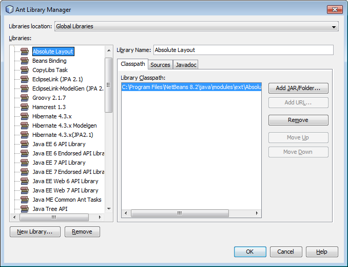

# Le Retour De Princesse Beach

Le Retour de Princesse Beach est un jeu de survie inspiré par Space Invaders et Super Mario Bros. 
Le but du jeu est simple: on incarne la Princesse Beach 
et on doit éliminer le plus d'ennemis possible afin accumuler des points sans mourir.

Le jeu est construit sur Java à partir de la librairie "slick2D" et à partir de spritesheet pris sur Internet.
Liens pour les Spritesheets:

# Comment jouer

UP: Voler vers le haut
DOWN: Voler vers le bas
LEFT: Voler vers la gauche
RIGHT: Voler vers la droite
SPACE : Attaquer

# Librairies à importer

Si la librairie est déjà installée sur votre ordinateur, allez à l'étape 6.

1. Télécharger le fichier «slick2Dlib.zip» : http://slick.ninjacave.com/wiki/index.php?title=Setting_up_Slick2D_with_NetBeansIDE

  

2. Décompresser le fichier et noter le chemin du dossier.
3. Importer la librairie dans Netbeans : Sur la barre du menu, aller sur Tools > Librairies > New Library
4. Nommer la librairie «Slick2D» et appuyer sur OK
5. Appuyer sur «Add JAR/Folder» pour ajouter les fichiers «jinput.jar», «lwlgl.jar», «lwlgl_util.jar», «slick.jar»
6. Ajouter la librairie sur le projet : Dans votre projet, clique droit sur l'onglet «Librairies» > 
Add library et choisir la librairie «Slick2D» pour l'ajouter. Vous devriz voir les 4 librairies ajoutées.

# Construction du jeu

### Le décor

### La Princesse

La princesse vole en hover et est affectée par la gravité. Elle attaque des ennemis avec des boulets et gagne 10 points pour chaque ennemi éliminé. Elle commence avec 3 vies et si elle se fait toucher, elle perd une vie. Lorsqu'elle n'a plus de vies, celle-ci tombe au sol et la partie est terminée.

### Les ennemis

Les ennemis arrivent par vague. Plus le jeu avance, plus les vagues arrivent rapidement et plus les ennemis se déplacent rapidement. 

Il existe plusieurs types d'ennemis:
- Straight Line: Se déplacent en ligne droite
- Zig Zag: Se déplacent en zigzag. L'amplitude change
- S Shape: Se déplacent en fonction sinusoidale. L'amplitude change
- Follow: se déplace toujours vers le joueur
- Rocket: Se déplace très rapidement en ligne droite
- Grenouille: Fait des bonds au sol de manière imprévisible
- Angry Cloud: Un koopa sur un nuage lâche des objets. Le nuage fait plusieurs aller-retours avant de partir
- Angry Plant: Une plante se déplace au solet crache des boules de feu vers le ciel
- Bulles: Si Beach touche la bulle, celle-ci éclate et lui fait perdre une vie
- Trampoline Dude: Un Koopa est sur un trampoline et saute à des hauteurs aléatoires pour lancer des haches qui tombent paraboliquement
- Flappy Bird: Un battement d'aile est toujours la même amplitude, mais la fréquence des battements change

### Les bonus

Lorsque les ennemis sont éliminés, ceux-ci peuvent laisser des items derrières eux. 
Lorsque Beach récupère ces objets, elle gagne une abilité temporairement et gagne 5 points supplémentaires.

Il existe plusieurs types de bonus:
- One up: Redonne une vie pour un maximum de 3
- Bombe: Élimine tous les ennemis sur l'écran 
- 3 boulets: Les attaques de Beach envoie 3 boulets au lieu d'un seul
- Attack Speed Potion: Beach attaque plus rapidement
- Speed: Beach se déplace plus rapidement
- Bonus Point: Beach obtient 50 points bonus
- Shield: Beach obtient un bouclier qui la protège pour une attaque
- Fireball: Les attaques de Beach transpersent tout sur leur passages
- Bloc: Lorsque Beach détruit le bloc, un item apparait
- Killer Instinct: Les boulets de Beach suivent l'ennemi le plus proche
- Cold Blood Killer: Beach obtient 2x plus de points pour chaque ennemi éliminé

